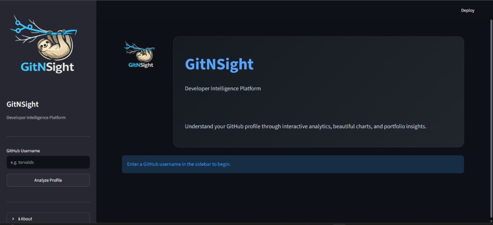
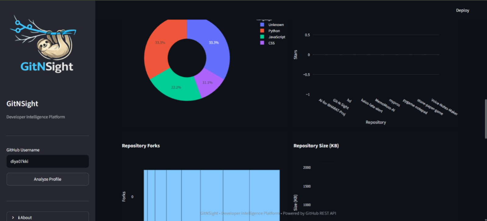

#  GitNSight

> Developer Intelligence Platform

GitNSight is a modern GitHub analytics dashboard built with **Python** and **Streamlit** that provides meaningful insights into any public GitHub profile through interactive visualizations and repository analytics.

---

##  Preview

> Add screenshots here

<p align="center">





</p>

---

##  Features

-  Search any public GitHub profile
-  View developer profile information
-  Interactive repository analytics
-  GitNSight Developer Score
-  Programming language distribution
-  Repository stars visualization
-  Repository forks visualization
-  Repository size analysis
-  Developer insights generation
-  Repository explorer with search
-  Export repository data as CSV
-  Modern dark-themed UI
-  Custom GitNSight branding

---

##  Tech Stack

| Category | Technologies |
|----------|--------------|
| Language | Python |
| UI | Streamlit |
| Charts | Plotly |
| Data | Pandas |
| API | GitHub REST API |
| Version Control | Git & GitHub |

---

##  Project Structure

```
GitNSight
│
├── assets/
│   ├── logo.png
│   ├── chart.svg
│   ├── dashboard.svg
│   ├── explore.svg
│   ├── file.svg
│   ├── fork.svg
│   ├── graph.svg
│   ├── insight.svg
│   ├── search.svg
│   └── star.svg
│
├── analytics.py
├── charts.py
├── github_api.py
├── streamlit_app.py
├── theme.py
├── utils.py
├── requirements.txt
└── README.md
```

---

##  Installation

Clone the repository

```bash
git clone https://github.com/diya07kki/Git-N-Sight.git
```

Move into the project directory

```bash
cd Git-N-Sight
```

Install dependencies

```bash
pip install -r requirements.txt
```

Run the application

```bash
streamlit run streamlit_app.py
```

---

##  Dashboard Includes

- Developer Profile
- GitNSight Score
- Developer Level
- Repository Spotlight
- Language Distribution
- Repository Stars
- Repository Forks
- Repository Size Analysis
- Repository Explorer
- AI-inspired Developer Insights

---

##  Future Improvements

- GitHub Contribution Heatmap
- Commit Activity Timeline
- AI Repository Summary
- PDF Report Export
- Profile Comparison
- Organization Analytics
- Contribution Prediction
- Repository Health Score

---

##  Author

**Diya Samanta**

B.Tech Computer Science & Business Systems

Institute of Engineering and Management, Kolkata

GitHub: https://github.com/diya07kki

---

##  Support

If you found this project useful, consider giving it a ⭐ on GitHub.